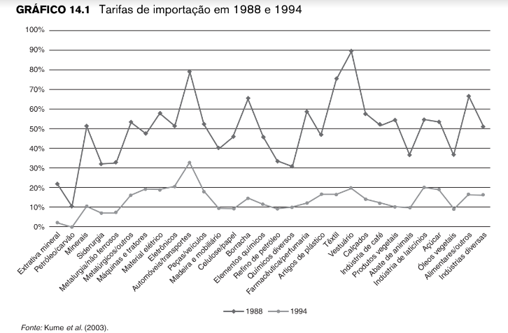
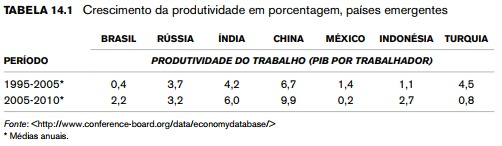
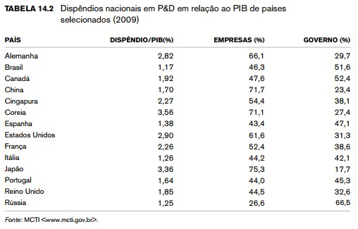

```{r echo=FALSE, fig.align='right', out.width="15%"}
knitr::include_graphics("img/logo.fw.png")

```

# Introdução

- 	Mostrar como ocorreu a transição para uma economia urbanizada, pois era uma economia predominante agrária e rural para tornar uma economia com base na indústria, e como o brasil tentou seguir modelo de vários países para trazer o desenvolvimento industrial.

-	O artigo traz modelos teóricos que são essências no campo de economia internacional e são importantes para explicar os impactos esperados de uma liberalização comercial.

-	A partir de políticas industriais de substituição de importações, que fez com que a indústria brasileira se expandiu por meio também de políticas protecionistas.

-	Esse plano só foi possível com o crédito barato, subsídios fiscais e a política seletiva de importações que era caracterizada por preços baixos para insumos importados e restrições às importações de bens finais.


---
```{r echo=FALSE, fig.align='right', out.width="15%"}
knitr::include_graphics("img/logo.fw.png")

```
### Resultados dessa estratégia de desenvolvimento

-	Foi diferente dos países asiáticos que foram bem sucedidos.

-	O brasil não conseguiu alcançar a liderança internacional na produção de bens manufaturados.


-	O brasil tornou-se um participante marginal no comércio desses produtos desde então.
---
```{r echo=FALSE, fig.align='right', out.width="15%"}
knitr::include_graphics("img/logo.fw.png")

```
### Abertura,Exportações e produtividade
- A teoria neoclássica de comércio internacional (modelo de Hecksher-Ohlin,
com sucessivos aprimoramentos posteriores) tem previsões claras para os efeitos de uma liberalização comercial.
- Em 1988, grande parte das barreiras não tarifárias foi abolida e algumas das tarifas nominais foram reduzidas.
- programa de
redução radical das tarifas de importação para os quatro anos seguintes:
<p align="center">                        <!--largura--> <!--Altura-->
    
</p>
---
```{r echo=FALSE, fig.align='right', out.width="15%"}
knitr::include_graphics("img/logo.fw.png")

```
- As indústrias mais protegidas eram as de automóveis,
borracha, farmacêutica, alimentos/outros, têxteis e vestuário, que chegavam a
ter uma tarifa de importação na casa de 90%.

- Diminuição das tarifas de importação entre 1988 e 1994, No final do período,
as tarifas na maior parte dos setores flutuavam entre 10% e 20%.

#### Resulatdos da diminuição tarifária e abertura comercial.
- Queda de produtividade total dos fatores(PTF) de 16 setores industriais, 
em média 3,83% ao ano entre 1985 e 1990.

- Porém entre 1990 e 1997 esse mesmo indicador cresceu a uma taxa média anual de 2,65%
- Estimativas indicam que a redução das tarifas nominais pode ter levado a um acréscimo de 8-12% na taxa de crescimento da PTF.
---
```{r echo=FALSE, fig.align='right', out.width="15%"}
knitr::include_graphics("img/logo.fw.png")

```
### Mas como a liberalização comercial provocou esse ganho de produtividade?
Os principais canais podem ser: 

- A pressão competitiva sobre o mercado de produtos, que levaria as firmas a promover inovações tecnológicas em produto e/ou processo.

- Os ganhos de eficiência promovidos pela adoção de equipamentos e insumos estrangeiros.

- O principal mecanismo responsável por isso é a de importação de insumos que beneficiou todas as firmas de forma similar.

- A eliminação,por meio do aumento da concorrência, de firmas menos produtivas, elevando,consequentemente, o nível de produtividade médio da indústria.
_________________________________________________________________________________
As firmas mais produtivas ganharam parcelas de mercado durante o processo de abertura comercial, o que também contribuiu para o aumento da produtividade da indústria.


---
```{r echo=FALSE, fig.align='right', out.width="15%"}
knitr::include_graphics("img/logo.fw.png")

```
# Abertura e mercado de trabalho


---
```{r echo=FALSE, fig.align='right', out.width="15%"}
knitr::include_graphics("img/logo.fw.png")

```
## Inovações e crescimento econômico

- Um dos maiores determinantes do crescimento econômico no longo prazo é
o crescimento da produtividade.

- Medida em termos de produtividade do trabalho (PIB por trabalhador), a evolução
da produtividade brasileira equipara-se à de países como México, Indonésia e
Turquia, permanecendo, no entanto, bastante atrás de outros Brics, como Rússia, Índia e China.

- O nosso problema de produtividade foi agravado pelas transformações estruturais que ocorreram na economia brasileira.

- No Brasil, a produtividade do trabalho na indústria de transformação permaneceu estagnada entre 1980 e 2005, nos Estados Unidos ela quase triplicou e na Coreia do Sul mais do que quintuplicou.

- Uma primeira parte dessa resposta pode ser encontrada por meio da comparação internacional dos dispêndios em pesquisa e desenvolvimento (P&D).

---
```{r echo=FALSE, fig.align='right', out.width="15%"}
knitr::include_graphics("img/logo.fw.png")

```
<p align="center">                        <!--largura--> <!--Altura-->
    
</p>

- Outro limitador importante das atividades de inovação é a baixa capacidade
das empresas de absorção de novos conhecimentos, dados o baixo nível educacional dos seus trabalhadores e a reduzida participação de engenheiros, mestres e doutores em seus quadros.

- Além disso, o Brasil tem um problema muito sério de práticas gerenciais atrasadas.

<p align="center">                        <!--largura--> <!--Altura-->
    
</p>
---
```{r echo=FALSE, fig.align='right', out.width="15%"}
knitr::include_graphics("img/logo.fw.png")
```
<p align="center">                        <!--largura--> <!--Altura-->
    
</p>

---
```{r echo=FALSE, fig.align='right', out.width="15%"}
knitr::include_graphics("img/logo.fw.png")

```
# Muito Obrigado !

---
```{r echo=FALSE, fig.align='right', out.width="15%"}
knitr::include_graphics("img/logo.fw.png")

```
### Tecnologias utilizadas para esta apresentação: 

<p align="center">
    
</p>


